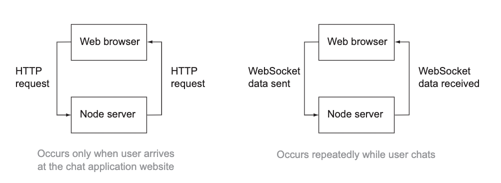
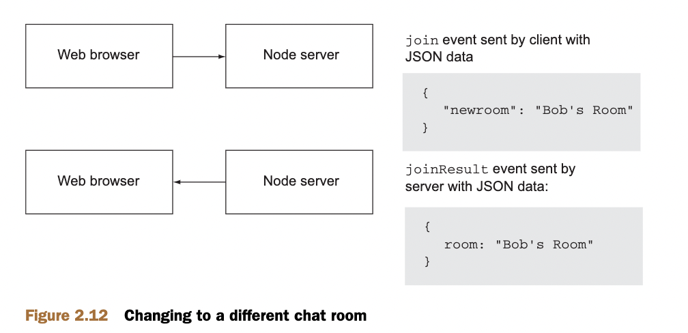

# node in action

## 前言

写一本关于nodejs的书籍是一项很有挑战性的工作。

## Part1 Node fundamentals（node 基本原理）

## Welcome to Node.js

这个章节覆盖以下内容：

1. node.js是什么
2. 服务器上的javascript
3. Node 的异步和事件性质
4. Node 设计用于的应用程序类型
5. Node示例程序

所以node.js是什么？它可能是你已经听到过的术语。或许已经使用node。也许你对此感到好奇。目前，Node 非常流行，年轻（2009年首次亮相）。这是 GitHub 上观看次数第二多的项目，它在 Google 群组中拥有相当多的追随者(http://groups.google.com/group/nodejs) 和 IRC 频道 (http://webchat.freenode.net/?channels=node.js)，并且拥有超过 15,000 个社区 mod-规则发布在 NPM（包管理器）(http://npmjs.org) 中。这一切都是为了说，这个平台背后有相当大的吸引力。

瑞安·达尔 (Ryan Dahl) 谈 Node：你可以在JSCONF Berlin 2009网站上观看Node的第一次演示，演讲者是创建者Ryan Dahl。链接是http://jsconf.eu/2009/video_nodejs_by_ryan_dahl.html。

官方网站（http://www.nodejs.org）将Node定义为“基于Chrome的JavaScript运行时平台，可轻松构建快速、可扩展的网络应用。Node.js使用事件驱动、非阻塞I/O模型，使其轻巧高效，非常适合跨分布式设备运行的数据密集型实时应用。”
在本章中，我们将探讨以下概念：

1. 为什么 JavaScript 对于服务器端开发很重要
2. 浏览器如何使用JavaScript处理I/O
3. Node在服务器端如何处理I/O
4. DIRTy应用程序的含义以及它们为什么适合Node
5. 一些基本Node程序的样例
6. 让我们先关注JavaScript...

#### **1.1 基于 JavaScript 构建**

无论好坏，JavaScript 都是世界上最流行的编程语言。如果你做过任何网络编程，这是不可避免的。 JavaScript，因为网络的纯粹覆盖范围，实现了 Java 的“一次编写，随处运行”的梦想
早在20世纪90年代。
2005 年 Ajax 革命前后，JavaScript 从一个“玩具”语言变成了一个人们用语言来编写真实且重要的程序。 一些值得注意的第一个是 Google 地图和 Gmail，并且今天有许多网络应用程序从 Twitter 到 Facebook 再到 GitHub。
自 2008 年底发布 Google Chrome 以来，由于浏览器供应商（Mozilla、Microsoft、Apple、Opera 和 Google）之间的激烈竞争，改进速度令人难以置信，JavaScript 性能已大幅提升。 这些现代的表现JavaScript 虚拟机正在真正改变您可以构建的应用程序类型。一个引人注目且坦率地说令人兴奋的例子是 jslinux，一台 PC在 JavaScript 中运行的模拟器，您可以在其中加载 Linux 内核，与终端会话，并编译 C 程序，所有这些都在您的浏览器中进行。
Node 使用 V8，即为 Google Chrome 提供支持的虚拟机，用于服务器端编程。 V8 为 Node 带来了巨大的性能提升，因为它省去了中间人，比起执行，更喜欢直接编译为本机机器代码字节码或使用解释器。 由于 Node 在服务器上使用 JavaScript，因此还有其他好处：

1. 开发人员可以用一种语言编写 Web 应用程序，这有助于减少在客户端和服务器开发之间进行上下文切换，并允许客户端和服务器之间的代码共享，例如表单重复使用相同的代码验证或游戏逻辑
2. JSON 是当今非常流行的数据交换格式，并且是 JavaScript 原生的
3. JavaScript 是各种 NoSQL 数据库（例如 CouchDB和 MongoDB），因此与它们交互是很自然的事情（例如，MongoDB 的 shell 和查询语言是 JavaScript； CouchDB的map/reduce是JavaScript）。
4. JavaScript 是一个编译目标，并且已经有许多语言可以编译它。
5. Node 使用一台符合 ECMAScript 标准的虚拟机 (V8)。5 换句话说，您不必等待所有浏览器都赶上来在 Node 中使用新的 JavaScript 语言功能

谁知道 JavaScript 最终会成为一种引人注目的用于编写服务器端应用程序的语言？ 然而，由于其广泛的覆盖范围、性能和其他特征前面提到，Node 已经获得了很大的关注。 JavaScript 只是这个难题的一小部分； Node 使用 JavaScript 的方式更加引人注目。 为了了解 Node 环境，让我们深入了解您最熟悉的 JavaScript 环境：浏览器。

#### **1.2 异步和事件驱动：浏览器**

  node提供一个事件驱动和异步平台给服务端js。它将js引入服务器的方式与浏览器引入客户端的方式非常相似。为了理解 Node 的工作原理，了解浏览器的工作原理非常重要。 两者都是事件驱动的（它们使用事件循环）并且在处理 I/O 时是非阻塞的（它们使用异步 I/O）。 让我们看一个例子来解释这意味着什么
事件循环和异步I/O 想了解更多关于事件循环和异步I/O，可以看Wikipedia相关的文章： http://en.wikipedia.org/wiki/Event_loop 、 http://en.wikipedia.org/wiki/Asynchronous_I/O
采用 jQuery 使用 XMLHttp-Request (XHR) 执行 Ajax 请求的常见片段

```js
$.post('/resource.json',function(data){
    console.log(data);
    });//script execution continues  
I/O 不会阻塞执行
```

该程序对resource.json执行HTTP请求。 当响应返回时，将调用包含参数数据的匿名函数（在本上下文中称为“回调”），该参数数据是从该请求接收到的数据
注意代码不是这样写的：

```js
vardata=$.post('/resource.json'); // I/O阻塞直到执行结束
console.log(data); 

```

浏览器中非阻塞 I/O 的示例

在此示例中，假设 resources.json 的响应在准备就绪时将存储在 data 变量中，并且在此之前 console.log 函数不会执行。I/O 操作（Ajax 请求）将“阻止”脚本继续执行，直到准备就绪。由于浏览器是单线程的，如果此请求需要 400 毫秒返回，则该页面上发生的任何其他事件都会等到那时才执行。您可以想象如果动画暂停或用户尝试以某种方式与页面交互，用户体验会很差。
  值得庆幸的是，事实并非如此。 当 I/O 发生在浏览器中时，它发生在事件循环之外（主脚本执行之外），然后当 I/O 完成时发出一个“事件”，由函数处理通常称为“回调”）如图1.1所示
  I/O 异步发生，不会“阻止”脚本执行，从而允许事件循环响应页面上正在执行的任何其他交互或请求。 这使得浏览器能够响应客户端并处理页面上的大量交互。
  记下这一点，然后切换到服务器

#### **1.3 异步和事件驱动：服务器**

  在大多数情况下，您可能熟悉服务器端编程的传统 I/O 模型，例如 1.2 节中的“阻塞”jQuery 示例。 这是 PHP 中的示例

```js
$result=mysql_query('SELECT*FROMmyTable'); // 执行会暂停直到DB请求完成
print_r($result);

```

  此代码执行一些 I/O，并且该进程将被阻止继续执行，直到所有数据返回。对于许多应用来说，这个模型很好并且很容易遵循。可能不明显的是，该进程具有状态或内存，并且在 I/O 完成之前基本上不执行任何操作。这可能需要 10 毫秒到几分钟不等，具体取决于 I/O 操作的延迟。意外原因也可能导致延迟：

1. 磁盘正在执行维护操作，暂停读/写
2. 由于负载增加，数据库查询速度变慢
3. 由于某种原因，今天从 sitexyz.com 提取资源的速度很慢。
   如果程序在 I/O 上阻塞，当有更多请求需要处理时服务器会做什么？通常，您会在这种情况下使用多线程方法。一种常见的实现是每个连接使用一个线程，并为这些连接设置一个线程池。您可以将线程视为计算工作空间，处理器在其中处理一项任务。在许多情况下，线程包含在进程内并维护自己的工作内存。每个线程处理一个或多个服务器连接。虽然这听起来像是一种委派服务器工作的自然方式（至少对于长期这样做的开发人员来说是这样），但管理应用程序中的线程可能很复杂。此外，当需要大量线程来处理许多并发服务器连接时，线程会消耗操作系统资源。线程需要 CPU 来执行上下文切换，以及额外的RAM.
   为了说明这一点，让我们看一个比较 NGINX 和 Apache 的基准测试（如图 1.2 所示，来自 http://mng.bz/eaZT）。 NGINX (http://nginx.com/)，如果你不熟悉的话，它是一个像 Apache 一样的 HTTP 服务器，但它没有使用阻塞 I/O 的多线程方法，而是使用具有异步 I/O 的事件循环。 （如浏览器和 Node）。 由于这些设计选择，NGINX 通常能够处理更多请求和连接的客户端，使其成为响应速度更快的解决方案。
   在 Node 中，I/O 几乎总是在主事件循环之外执行，从而使服务器保持高效和响应能力，就像 NGINX 一样。 这使得进程更难成为 I/O 限制，因为 I/O 延迟不会使您的服务器崩溃，也不会像阻塞一样使用资源。 它允许服务器轻量级执行服务器通常执行的最慢的操作。
   事件驱动和异步模型以及广泛使用的 JavaScript 语言的这种组合有助于打开数据密集型实时应用程序的令人兴奋的世界。
   

#### **1.4 脏应用程序**

实际上，Node 设计的应用程序类型有一个缩写词：DIRT。它代表数据密集型实时应用程序。由于 Node 本身在 I/O 方面非常轻量级，因此它擅长将数据从一个管道转移或代理到另一个管道。它允许服务器保持多个连接打开，同时处理许多请求并保持较小的内存占用。它被设计为响应式的，就像浏览器一样。实时应用程序是网络的一个新用例。 现在，许多网络应用程序几乎可以即时提供信息，实现在线白板协作、实时定位接近的公共交通巴士以及多人游戏等功能。无论是通过实时组件增强现有应用程序还是全新类型的应用程序，网络都正在朝着更具响应性和协作性的环境发展。然而，这些新型 Web 应用程序需要一个能够几乎立即响应大量并发用户的平台。Node 擅长于此，不仅适用于 Web 应用程序，还适用于其他 I/O 密集型应用程序
  使用 Node 编写的 DIRTy 应用程序的一个很好的例子是 Browserling（brow-serling.com，如图 1.3 所示）。该网站允许在浏览器内使用其他浏览器。这对于前端开发者来说非常有用，因为它使他们不必安装大量浏览器和操作系统来测试。Browserling 利用名为 StackVM 的node驱动项目，该项目管理使用 QEMU（快速仿真器）模拟器创建的虚拟机 (VM)。QEMU 模拟运行浏览器所需的 CPU 和外设。
   
  Browserling浏览器让虚拟机运行测试浏览器，然后将键盘和鼠标输入数据从用户浏览器中传递到模拟浏览器，而模拟浏览器又流式传输模拟浏览器的重绘区域，并将它们重新绘制在用户浏览器的canvas上。如图1.4说明的。Browserling 还提供了一个使用 Node 的补充项目，称为 Testling(testling.com)，它允许您从命令行针对多个浏览器并行运行测试套件
  
  （1） 在浏览器中，用户的鼠标和键盘事件通过 WebSocket 实时传递到 Node.js，Node.js 又将它们传递到模拟器
  （2）受用户交互影响的模拟浏览器的重绘区域通过 Node 和 WebSocket 流回，并绘制在浏览器的画布上。
  Browserling和Testling是 DIRTy 应用程序的好例子，当您坐下来编写第一个 Node 应用程序时，用于构建此类可扩展网络应用程序的基础设施正在发挥作用。 让我们看看 Node 的 API 如何提供这个开箱即用的工具。

#### 1.5 DIRTy by default

   Node 是从头开始构建的，具有事件驱动和异步模型。JavaScript 从来没有标准 I/O 库，而这对于服务器端语言来说是常见的。JavaScript 的“宿主”环境始终决定这一点。JavaScript 最常见的宿主环境（大多数开发人员都习惯使用的环境）是浏览器，它是事件驱动和异步的。
   Node 尝试通过重新实现通用主机对象来保持浏览器和服务器之间的一致性，例如这些：
   Timer API (for example, setTimeout)
   Console API (for example, console.log)
  Node 还包括一组用于多种类型网络和文件 I/O 的核心模块。其中包括 HTTP、TLS、HTTPS、文件系统 (POSIX)、数据报 (UDP) 和 NET (TCP) 模块。 核心有意设计得小、低级且不复杂，仅包括基于 I/O 的应用程序的构建块。 第三方模块构建在这些块的基础上，为常见问题提供更好的抽象

 ** Platform vs. framework **
 Node 是 JavaScript 应用程序的平台，不要与框架混淆。 将 Node 视为 Rails 或 JavaScript 的 Django 是一种常见的误解，但实际上它的级别要低得多。 但是，如果您对 Web 应用程序的框架感兴趣，我们将在本书后面讨论一个流行的 Node 框架，称为 Express

 经过所有这些讨论，您可能想知道 Node 代码是什么样的。 让我们看几个简单的例子：

** 1.5.1 简单的异步示例 **

 在 1.2 节中，我们查看了使用 jQuery 的 Ajax 示例

```js
$.post('/resource.json',function(data){
    console.log(data);
    });//script execution continues  
```

让我们在 Node 中做类似的事情，但我们将使用文件系统 (fs) 模块从磁盘加载 resource.json。 请注意该程序与前面的 jQuery 示例有多么相似：

```js
varfs=require('fs');fs.readFile('./resource.json',function(er,data){console.log(data);}) 
```

在此程序中，我们从磁盘读取resource.json 文件。 当读取所有数据时，将调用匿名函数（也称为“回调”），其中包含参数 er、如果发生任何错误以及 data（文件数据）
该进程在幕后循环，能够处理可能发生的任何其他操作，直到数据准备好为止。 我们之前讨论过的所有事件和异步优势都会自动发挥作用。 这里的区别在于，我们不是使用 jQuery 从浏览器发出 Ajax 请求，而是访问 Node 中的文件系统以获取grabresource.json。 后一个动作如图 1.5 所示


　**1.5.2 Hello World HTTP server**

  Node 的一个非常常见的用例是构建服务器。 Node 使得创建不同类型的服务器变得非常简单。 如果您习惯于让服务器托管您的应用程序（例如托管在 Apache HTTP 服务器上的 PHP 应用程序），这可能会感觉很奇怪。在 Node 中，服务器和应用程序是相同的。

```js
varhttp=require('http');http.createServer(function(req,res){res.writeHead(200,{'Content-Type':'text/plain'});res.end('HelloWorld\n');}).listen(3000);console.log('Serverrunningathttp://localhost:3000/');

varhttp=require('http');varserver=http.createServer();
server.on('request',function(req,res){res.writeHead(200,{'Content-Type':'text/plain'});res.end('HelloWorld\n');})
server.listen(3000);
console.log('Serverrunningathttp://localhost:3000/');
```

每当请求发生时，就会触发 回调函数function(req,res) ，并写出“HelloWorld”作为响应。 此事件模型类似于侦听浏览器中的 onclick 事件。 单击可能在任何时候发生，因此您设置一个函数来执行一些逻辑来处理该问题。 在这里，Node 提供了一个函数，每当请求发生时都会做出响应。

　** 1.5.3 Streaming data **

Node在streams和streaming方面也很强大。 您可以将streams视为类似于数组，但数据不是分布在空间上，而是可以将streams视为分布在时间上的数据。 通过逐块引入数据，开发人员能够在数据进来时对其进行处理，而不是等待所有数据到达后再采取行动。 这是流式传输 resources.json 的方式

```js

varstream=fs.createReadStream('./resource.json')
stream.on('data',function(chunk){console.log(chunk)})
stream.on('end',function(){console.log('finished')})
```

每当新的数据块准备就绪时，就会触发数据事件，而当所有数据块都已加载时，就会触发结束事件。块的大小可能会有所不同，具体取决于数据类型。 这种对读取流的低级访问使您可以在读取数据时有效地处理数据，而不是等待所有数据都缓冲在内存中。
可读和可写的流可以连接起来形成管道，就像使用 | （pipe）一样。 shell 脚本中的（管道）运算符。 这提供了一种在数据准备好后立即写出数据的有效方法，而无需等待完整的资源被读取然后写出
让我们使用之前的 HTTP 服务器来说明将图像流式传输到客户端

```js
varhttp=require('http');
varfs=require('fs');
http.createServer(function(req,res){res.writeHead(200,{'Content-Type':'image/png'});fs.createReadStream('./image.png').pipe(res);}).listen(3000);
// Piping from a readable stream to a writable stream
console.log('Serverrunningathttp://localhost:3000/');
```

在此单行代码中，数据从文件 (fs.createReadStream) 中读入，并在传入时将其发送 (.pipe) 到客户端 (res)。事件循环能够在数据被读取时处理其他事件。
Node 跨多个平台（包括各种 UNIX 和 Windows）提供了这种默认的 DIRTy 方法。 底层异步 I/O 库 (libuv) 专为提供统一体验而构建，无论父操作系统如何，这使得程序可以更轻松地跨设备移植，并在需要时在多个设备上运行

#### 1.6 总结

与任何技术一样，Node 并不是灵丹妙药。 它只是帮助您解决某些问题并开启新的可能性。 Node 的有趣之处之一是它将系统各个方面的人们聚集在一起。 许多人作为 JavaScript 客户端程序员来到 Node； 其他人是服务器端程序员； 其他人是系统级程序员。 无论您适合哪里，我们希望您了解 Node 适合您的堆栈中的位置

回顾：
基于 JavaScript 构建
异步和事件驱动
设计给数据密集型实时应用

在第 2 章中，我们将构建一个简单的 DIRTy Web 应用程序，以便您可以了解Node用程序的工作原理

# 第二章 Building a multiroom chat application

  在第 1 章中，您了解了使用 Node 的异步开发与传统的同步开发有何不同。 在本章中，我们将通过创建一个小型事件驱动的聊天应用程序来实际了解 Node。 如果本章中的细节让您难以理解，请不要担心； 我们的目的是揭开 Node 开发的神秘面纱，并让您预览完成本书后您将能够做什么。

  本章假设您有 Web 应用程序开发经验，对 HTTP 有基本了解，并且熟悉 jQuery。 当您阅读本章时，您将本章假设您有 Web 应用程序开发：

（1）浏览该应用程序以了解其工作原理

（2）查看技术要求并执行初始应用程序设置

（3）为应用程序的 HTML、CSS 和客户端 JavaScript 提供服务

（4）使用 Socket.IO 处理与聊天相关的消息传递

（5）将客户端 JavaScript 用于应用程序的 UI

### 应用概述

  您将在本章中构建的应用程序允许用户通过在简单的表单中输入消息来相互在线聊天，如图 2.1 所示。输入消息后，该消息将发送给同一聊天室中的所有其他用户。

   启动应用程序时，系统会自动为用户分配一个访客名称，但他们可以通过输入命令来更改它，如图 2.2 所示。 聊天命令以斜线 (/) 开头。

  类似地，用户可以输入命令来创建一个新的聊天室（如果已经存在则加入它），如图2.3所示。 加入或创建房间时，新的房间名称将显示在聊天应用程序顶部的水平栏中。 该房间还将包含在聊天消息区域右侧的可用房间列表中。

  用户变更到新房间后，系统会确认变更，如图2.4所示。

  虽然该应用程序的功能故意是简单的，但它展示了创建实时 Web 应用程序所需的重要组件和基本技术。 该应用程序展示了 Node 如何同时提供传统 HTTP 数据（如静态文件）和实时数据（聊天消息）。 它还展示了 Node 应用程序是如何组织的以及如何管理依赖关系。

  现在让我们看看实现该应用程序所需的技术。

#### 应用要求和初始设置

您将创建的聊天应用程序需要执行以下操作：

（1）提供静态文件（例如 HTML、CSS 和客户端 JavaScript）

（2）在服务器上处理与聊天相关的消息传递

（3）在用户的网络浏览器中处理与聊天相关的消息传递

  对于服务端静态文件，您要使用 Node 的内置 http 模块。 但是，当通过 HTTP 提供文件服务时，仅发送文件内容通常是不够的； 您还应该包括正在发送的文件类型。 这是通过使用文件的正确 MIME 类型设置 Content-Type HTTP header 来完成的。 要查找这些 MIME 类型，您将使用名为 mime 的第三方模块。

  要处理与聊天相关的消息传递，您可以使用 Ajax 轮询服务器。 但为了使该应用程序尽可能响应，您将避免使用传统的 Ajax 作为发送消息的方式。 Ajax 使用 HTTP 作为传输机制，而 HTTP 并不是为实时通信而设计的。 当使用 HTTP 发送消息时，必须使用新的 TCP/IP 连接。 打开和关闭连接需要时间，并且数据传输的大小较大，因为每个请求都会发送 HTTP 头。此应用程序不会采用依赖于 HTTP 的解决方案，而是更喜欢 Web-Socket (http://en.wikipedia. org/wiki/WebSocket），被设计为双向轻量级通信协议，支持实时通信。

  由于大多数情况下只有兼容 HTML5 的浏览器才支持 WebSocket，因此应用程序将利用流行的 Socket.IO 库 (http://socket.io/)，该库提供了许多后备方案，包括使用 Flash，因此应使用 WebSocket 不可能。 Socket.IO 透明地处理回退功能，不需要额外的代码或配置。 第 13 章更深入地介绍了 Socket.IO。

  在我们开始实际进行设置应用程序的文件结构和依赖项的初步工作之前，让我们更多地讨论一下 Node 如何让您同时处理 HTTP 和 WebSocket——这也是它成为实时应用程序的最佳选择的原因之一

#### Serving HTTP and WebSocket

  尽管此应用程序将避免使用 Ajax 来发送和接收聊天消息，但它仍将使用 HTTP 来传递在用户浏览器中进行设置所需的 HTML、CSS 和客户端 JavaScript。



  Node 可以使用单个 TCP/IP 端口轻松处理同时服务的 HTTP 和 WebSocket，如图 2.5 所示。 Node 附带一个提供 HTTP 服务功能的模块。 有许多第三方 Node 模块，例如 Express，它们构建在 Node 的内置功能之上，使 Web 服务变得更加容易。我们将在第 8 章中深入讨论如何使用 Express 构建 Web 应用程序。 然而，在本章的应用中，我们将坚持基础知识。

  现在您已经大致了解了应用程序将使用的核心技术，让我们开始充实它

#### 2. 1 Creating the application file structure

  要开始构建教程应用程序，请为其创建一个项目目录。 主应用程序文件将直接位于该目录中。 您需要添加一个 lib 子目录，其中将放置一些服务器端逻辑。 您需要创建一个公共子目录来放置客户端文件。 在 public 子目录中，创建一个 javascripts 子目录和一个 stylesheets 目录。

  您的目录结构现在应如图 2.6 所示。 请注意，虽然我们在本章中选择以这种特定方式组织文件，但 Node 并不要求您维护任何特定的目录结构；应用程序文件可以以对您有意义的任何方式组织。

  现在您已经建立了目录结构，您将需要指定应用程序的依赖项。

  在这种情况下，应用程序依赖项是需要安装以提供应用程序所需功能的模块。 举例来说，您正在创建一个应用程序，需要访问使用 MySQL 数据库存储的数据。Node 没有提供允许访问 MySQL 的内置模块，因此您必须安装第三方 模块，这将被视为依赖项。

#### 2.2 Specifying dependencies

  尽管您可以在不正式指定依赖项的情况下创建 Node 应用程序，但花时间指定它们是一个好习惯。 这样，如果您希望其他人使用您的应用程序，或者您计划在多个地方运行它，那么设置就变得更加简单。

  应用程序依赖项是使用 package.json 文件指定的。 该文件始终放置在应用程序的根目录中。 package.json 文件由遵循 CommonJS 包描述符标准 (http://wiki.commonjs.org/wiki/Packages/1.0) 的 JSON 表达式组成，并描述您的应用程序。 在 package.json 文件中，您可以指定很多内容，但最重要的是应用程序的名称、版本、应用程序功能的描述以及应用程序的依赖项。

  清单 2.1 显示了一个包描述符文件，它描述了教程应用程序的功能和依赖项。 将此文件保存为教程应用程序的根目录中的 package.json。

  如果这个文件的内容看起来有点令人困惑，别担心...您将在下一章中了解有关 package.json 文件的更多信息，并在第 14 章中深入了解。

#### 2.3 Installing dependencies

  定义了 package.json 文件后，安装应用程序的依赖项就变得很简单。 Node 包管理器（npm；https://github.com/isaacs/npm）是一个与 Node 捆绑在一起的实用程序。 它提供了大量的功能，允许您轻松安装第三方 Node 模块并全局发布您自己创建的任何 Node 模块。 它可以做的另一件事是从 package.json 文件中读取依赖项并使用单个命令安装每个依赖项

  在教程目录的根目录中输入以下命令

```javascript
npm install
```

  如果你现在查看教程目录，应该有一个新创建的node_modules目录，如图2.7所示。 该目录包含您的应用程序的依赖项

  建立目录结构并安装依赖项后，您就可以开始充实应用程序逻辑了

#### 2.4 Serving the application’s HTML, CSS, and client-side JavaScript

  如前所述，聊天应用程序需要能够执行三项基本操作：

（1）向用户的网络浏览器提供静态文件

（2）在服务器上处理与聊天相关的消息传递

（3）在用户的网络浏览器中处理与聊天相关的消息传递

  应用程序逻辑将由许多文件处理，一些在服务器上运行，一些在客户端上运行，如图2.8所示。 客户端运行的JavaScript文件需要作为静态资产，而不是由Node执行。

  在本节中，我们将解决第一个要求：我们将定义提供静态文件所需的逻辑。 然后我们将添加静态 HTML 和 CSS 文件本身。

##### 2.3.1 Creating a basic static file server

  为了创建静态文件服务器，我们将利用 Node 的一些内置功能以及第三方 mime 插件来确定文件 MIME 类型。

  要启动主应用程序文件，请在项目目录的根目录中创建一个名为 server.js 的文件，并将清单 2.2 中的变量声明放入其中。 这些声明将使您能够访问 Node 的 HTTP 相关功能、与文件系统交互的能力、与文件路径相关的功能以及确定文件的 MIME 类型的能力。 缓存变量将用于缓存文件数据。

```JavaScript
var http=require('http'); // Built-in http module provides HTTP server and client functionality；
var fs=require('fs'); // Built-in fs module provides file system related functionalit；
var path=require('path'); // Built-in path module provides filesystem path–related functionality
var mime=require('mime');// Add-on mime module provides ability to derive a MIME type based on a filename extension
var cache={}; // cache object is where the contents of cached files are stored

```

  **发送文件数据和错误响应**

  接下来，您需要添加三个用于提供静态 HTTP 文件的辅助函数。 第一个将在请求不存在的文件时处理 404 错误的发送。将以下辅助函数添加到 server.js

```javascript
function send404(response){
response.writeHead(404,{'Content-Type':'text/plain'});
response.write('Error404:resourcenotfound.');response.end();
}
```

  第二个辅助函数提供文件数据。 该函数首先写入适当的 HTTP 标头，然后发送文件的内容。 在server.js中添加以下代码:

```javascript
function sendFile(response,filePath,fileContents){
response.writeHead(
200,
{"content-type":mime.lookup(path.basename(filePath))});
response.end(fileContents);
}
```

  访问内存存储 (RAM) 比访问文件系统更快。 因此，Node 应用程序通常将常用数据缓存在内存中。 我们的聊天应用程序会将静态文件缓存到内存中，仅在第一次访问时从磁盘读取它们。 下一个帮助器确定文件是否被缓存，如果是，则提供该文件。 如果文件未缓存，则会从磁盘读取并提供服务。 如果该文件不存在，则会返回 HTTP 404 错误作为响应。 将此辅助函数添加到server.js:

```javascript
function serveStatic(response,cache,absPath){
if(cache[absPath]){ // Check if file is cached in memory
sendFile(response,absPath,cache[absPath]); // Serve file from memory
}else{
fs.exists(absPath,function(exists){ // Check if file exists
if(exists){
fs.readFile(absPath,function(err,data){ // Read file from disk
if(err){
send404(response);
}else{
cache[absPath]=data;
sendFile(response,absPath,data); // Serve file read from disk
}
}
);
}else{
send404(response); // Send HTTP 404 response
}
});
}
}
```

**创建 HTTP 服务器**

  对于 HTTP 服务器，提供了一个匿名函数作为 createServer 的参数，充当定义应如何处理每个 HTTP 请求的回调。回调函数接受两个参数：请求和响应。 当回调执行时，HTTP 服务器将使用对象填充这些参数，这些对象分别允许您计算出请求的详细信息并发回响应。您将在第 4 章中详细了解 Node 的 http 模块：

```JavaScript
var server = http.createServer(function(request,response){ // reate HTTP server, using anonymous function to define per-request behavior
varf ilePath=false;
if(request.url=='/'){
filePath='public/index.html'; // Determine HTML file to be served by default
}else{
filePath='public'+request.url; // Translate URL path to relative file path
}
var absPath='./'+filePath;
serveStatic(response,cache,absPath); // Serve static file
});
```

**启动 HTTP 服务器**

  您已在代码中创建了 HTTP 服务器，但尚未添加启动它所需的逻辑。 添加以下行，启动服务器，请求它侦听 TCP/IP 端口 3000。端口 3000 是任意选择； 任何高于 1024 的未使用端口都可以工作（如果您运行的是 Windows，则 1024 以下的端口也可能工作，或者如果在 Linux 或 OSX 中，您使用特权用户（例如“root”）启动应用程序

```javascript
server.listen(3000,function(){
console.log("Serverlisteningonport3000.");
});
```

  如果您想查看应用程序此时可以执行哪些操作，可以通过在命令行提示符中输入以下内容来启动服务器

`node server.js`

  服务器运行时，在浏览器中访问 http://127.0.0.1:3000 将触发 404 错误助手，并显示“错误 404：资源未找到”消息。 尽管您已添加静态文件处理逻辑，但尚未添加静态文件本身。 要记住的一点是，可以通过在命令行上使用 Ctrl-C 来停止正在运行的服务器

  接下来，让我们继续添加必要的静态文件，以使聊天应用程序功能更强大

##### 2.3.2 Adding the HTML and CSS files

  您要添加的第一个静态文件是基本 HTML。 在public目录中创建一个名为index.html的文件，并将清单2.5中的HTML放入其中。 HTML 将包含一个 CSS 文件，设置一些将在其中显示应用程序内容的 HTML div 元素，并加载许多客户端 JavaScript 文件。 JavaScript 文件提供客户端 Socket.IO 功能、jQuery（用于轻松 DOM 操作）以及几个提供聊天功能的特定于应用程序的文件

```html
<!doctypehtml>
    <htmllang='en'>

        <head>
            <title>Chat</title>
            <linkrel='stylesheet'href=' /stylesheets/style.css'>
                </link>
        </head>

        <body>
            <divid='content'>
                <divid='room'> // div in which the current room name will be displayed
                    </div>
                    <div id='room-list'></div> // div in whicha list ofavailablerooms willbe displayed
                    <div id='messages'></div> // div in which chat messages will be displayed
                    <form id='send-form'><inputid='send-message' />
<input id='send-button'type='submit'value='Send' /> // Form input element in which user will enter commands and messages
                        <div id='help'>Chatcommands:<ul>
                                <li>Changenickname:<code>/nick[username]</code></li>
                                <li>Join/createroom:<code>/join[roomname]</code></li>
                            </ul>
                            </div>
                            </form>
                            </div>
                            <scriptsrc=' /socket.io/socket.io.js'type='text/javascript'>
                                </script>
                                <scriptsrc='http: //code.jquery.com/jquery-1.8.0.min.js' ➥type='text/javascript'>
                                    </script>
                                    <scriptsrc=' /javascripts/chat.js'type='text/javascript'>
                                        </script>
                                        <scriptsrc=' /javascripts/chat_ui.js'type='text/javascript'>
                                            </script>
        </body>

        </html>
```

```css
body {
  padding: 50px;
  font: 14px "LucidaGrande", Helvetica, Arial, sans-serif;
}
a {
  color: #00b7ff;
}
#content {
  width: 800px;   // Application will be 800 pixels wide and horizontally centered
  margin-left: auto;
  margin-right: auto;
}
#room {
  background-color: #ddd;   // CSS rules for area in which current room name is displayed
  margin-bottom: 1em;
}
#messages { // Message display area will be 690 pixels wide and 300 pixels high
  width: 690px;
  height: 300px;
  overflow: auto;
  background-color: #eee;   // Allows div in which messages are displayed to scroll when it’s filled up with content
  margin-bottom: 1em;
  margin-right: 10px;
}
```

  大致完成 HTML 和 CSS 后，运行应用程序并使用 Web 浏览器查看。 该应用程序应如图 2.9 所示。

  该应用程序尚未运行，但正在提供静态文件并建立基本的视觉布局。 处理完这些后，让我们继续定义服务器端聊天消息调度。

##### 2.4 Handling chat-related messaging using Socket.IO

  在我们所说的应用程序必须做的三件事中，我们已经介绍了第一件事，即提供静态文件，现在我们将解决第二件事——处理浏览器和服务器之间的通信。 现代浏览器能够使用 WebSocket 处理浏览器和服务器之间的通信。 （有关支持的浏览器的详细信息，请参阅 Socket.IO 浏览器支持页面：http://socket.io/#browser-support。）

  Socket.IO 为 Node 和客户端 JavaScript 提供了一个基于 WebSocket 和其他传输的抽象层。 如果 WebSocket 未在 Web 浏览器中实现，同时保持相同的 API，Socket.IO 将透明地回退到其他 WebSocket 替代方案。 在本节中，我们将

（1）向您简要介绍 Socket.IO 并定义您在服务器端需要的 Socket.IO 功能

（2）添加设置 Socket.IO 服务器的代码

（3）添加代码来处理各种聊天应用程序事件

  Socket.IO 开箱即用，提供虚拟频道，因此您可以仅向订阅特定频道的用户广播，而不是向每个连接的用户广播每条消息。 此功能使得在应用程序中实现聊天室变得非常简单，稍后您将看到。

  Socket.IO 也是event emitters有用性的一个很好的例子。 本质上，event emitters是一种用于组织异步逻辑的便捷设计模式。 您将在本章中看到一些正在工作的event emitters代码，但我们将在下一章中详细介绍

```js
Event emitters
Event emitter与某种概念资源相关联，并且可以向该资源发送消息和从该资源接收消息。 
该资源可以是与远程服务器的连接或更抽象的东西，例如游戏角色。 
事实上，Johnny-Five 项目 (https://github.com/rwldrn/johnny- Five) 利用 Node 进行机器人应用，使用Event emitter来控制 Arduino 微控制器。
```

##### 2.4.1 Setting up the Socket.IO server

  首先，将以下两行附加到 server.js。 第一行从自定义 Node 模块加载功能，该模块提供处理基于 Socket.IO 的服务器端聊天功能的逻辑。 接下来我们将定义该模块。 下一行启动 Socket.IO 服务器功能，为其提供已定义的 HTTP 服务器，以便它可以共享相同的 TCP/IP 端口。

```javascript
var chatServer=require('./lib/chat_server');
chatServer.listen(server);
```

  您现在需要在 lib 目录中创建一个新文件 chat_server.js。 通过添加以下变量声明来启动此文件。 这些声明允许使用Socket.IO并初始化一些定义聊天状态的变量。

```JavaScript
var socketio=require('socket.io');
var io;
var guestNumber=1;
var nickNames={};
var namesUsed=[];
var currentRoom={};
```

**ESTABLISHING CONNECTION LOGIC**

  接下来，添加清单2.7中的逻辑来定义聊天服务器函数listen。 该函数在 server.js 中调用。 它启动 Socket.IO 服务器，限制 Socket.IO 日志记录到控制台的详细程度，并确定应如何处理每个传入连接。

  您会注意到，连接处理逻辑调用了许多辅助函数，您现在可以将这些函数添加到 chat_server.js。

```JavaScript

exports.listen = function(server){
 io = socketio.listen(server); // 启动 Socket.IO 服务器，允许它搭载现有的 HTTP 服务器
 io.set('loglevel',1);
 io.sockets.on('connection',function(socket){ // 定义如何处理每个用户连接
   guestNumber = assignGuestName(socket,guestNumber,nickNames,namesUsed); // 连接时为用户分配访客名称
   joinRoom(socket,'Lobby'); // 连接时将用户置于大厅房间
   handleMessageBroadcasting(socket,nickNames); // 处理用户消息、名称更改尝试和房间创建/更改
   handleNameChangeAttempts(socket,nickNames,namesUsed);
   handleRoomJoining(socket);

   socket.on('rooms',function(){ // 根据要求向用户提供已占用房间列表
     socket.emit('rooms',io.sockets.manager.rooms);
    });

   handleClientDisconnection(socket,nickNames,namesUsed); // 定义用户断开连接时的清理逻辑
});
};
```

  建立连接处理后，您现在需要添加单独的辅助函数来处理应用程序的需求。

##### 2.4.2 Handling application scenarios and events

  聊天应用程序需要处理以下类型的场景和事件：

（1）访客名称的指派

（2）更换房间请求

（3）更改名称请求

（4）发送聊天消息

（5）房间的创建

（6）用户断开连接

  为了处理这些问题，您将添加许多辅助函数。

**访客名称的指派（assignGuestName）**

  您需要添加的第一个辅助函数是 `allocateGuestName`，它处理新用户的命名。 当用户第一次连接到聊天服务器时，该用户被放置在名为 Lobby 的聊天室中，并调用 `allocateGuestName` 为他们分配一个名称，以将他们与其他用户区分开来。

  每个访客名称本质上都是 `Guest`一词，后跟一个数字，每次新用户连接时该数字都会递增。 `Guest`名称存储在 `nickNames` 变量中以供参考，与内部套接字 ID 相关联。 客人姓名也被添加到 `namesUsed` 中，这是一个存储正在使用的姓名的变量。 将以下清单中的代码添加到 lib/chat_server.js 以实现此功能。

```JavaScript
function assignGuestName(socket,guestNumber,nickNames,namesUsed) {
var name = 'Guest' + guestNumber; // Generate new guest name
nickNames[socket.id] = name;  // Associate guest name with client connection ID
socket.emit('nameResult',{ // Let user know their guest name
  success:true,
  name:name
});
namesUsed.push(name); // Note that guest name is now used
return guestNumber + 1; //  Increment counter used to generate guest names
}
```

**加入房间（JOINING ROOMS）**

  您需要添加到 chat_server.js 的第二个辅助函数是 join Room。 该函数如清单 2.9 所示，处理与用户加入聊天室相关的逻辑。 让用户加入 Socket.IO 房间很简单，只需要调用套接字对象的 join 方法。 然后，应用程序将相关详细信息传达给用户和同一房间中的其他用户。 该应用程序让用户知道房间里还有哪些其他用户，并让这些其他用户知道该用户现在在场。

```JavaScript
 function joinRoom(socket,room) {
  socket.join(room); // 用户加入房间 
  currentRoom[socket.id] = room;  // 请注意，用户现在在这个房间中
  socket.emit('joinResult',{room:room}); // 让用户知道他们现在在新房间
  socket.broadcast.to(room).emit('message',{ // 让房间中的其他用户知道该用户已加入
    text:nickNames[socket.id] + 'hasjoined' + room + '.'
  });

  var usersInRoom = io.sockets.clients(room); // 确定与用户在同一房间的其他用户
  if ( usersInRoom.length > 1 ) { // 如果存在其他用户，总结他们是谁
    var usersInRoomSummary = 'Users currently in' + room + ':';
    for(var index in usersInRoom) {
      var userSocketId = usersInRoom[index].id;
       if(userSocketId! = socket.id){
          if(index>0) {
             usersInRoomSummary + = ',';
        }

       usersInRoomSummary += nickNames[userSocketId];
         }
       }
      usersInRoomSummary += '.';
      socket.emit('message',{text:usersInRoomSummary}); // 将房间内其他用户的摘要发送给该用户
  }
}

```

**修改用户名（HANDLING NAME-CHANGE REQUESTS）**

  如果每个用户只保留他们的访客姓名，就很难记住谁是谁。因此，聊天应用程序允许用户请求更改姓名。 如图 2.10 所示，名称更改涉及用户的 Web 浏览器通过 Socket.IO 发出请求，然后接收指示成功或失败的响应。

  将以下清单中的代码添加到 lib/chat_server.js 以定义处理用户更改姓名请求的函数。 从应用程序的角度来看，用户不允许将其名称更改为以 Guest 开头的任何名称或使用已使用的名称。

```JavaScript
function handleNameChangeAttempts(socket, nickNames, namesUsed) {
  socket.on("nameAttempt", function (name) { // Add listener for nameAttempt events
    if (name.indexOf("Guest") == 0) { // 不允许将其名称更改为以 Guest 开头
      socket.emit("nameResult", {
        success: false,
        message: 'Namescannotbeginwith"Guest".',
      });
    } else {
      if (namesUsed.indexOf(name) == -1) { // 如果名称尚未注册，请注册
        var previousName = nickNames[socket.id];
        var previousNameIndex = namesUsed.indexOf(previousName);
        namesUsed.push(name);
        nickNames[socket.id] = name;
        delete namesUsed[previousNameIndex]; // Remove previous name to make available to other clients

        socket.emit("nameResult", { success: true, name: name });
        socket.broadcast
          .to(currentRoom[socket.id])
          .emit("message", {
            text: previousName + "isnowknownas" + name + ".",
          });
      } else {
        socket.emit("nameResult", { // Send error to client if name is already registered
          success: false,
          message: "Thatnameisalreadyinuse.",
        });
      }
    }
  });
}

```

 **发送聊天消息（SENDING CHAT MESSAGES）**

  现在已经处理了用户昵称，您需要添加一个函数来定义显示处理用户发送的聊天消息。 图2.11显示了基本流程：用户发出一个事件，指示要发送消息的房间和消息文本。 然后，服务器将消息转发给同一房间中的所有其他用户。

  将以下代码添加到 lib/chat_server.js。 Socket.IO的广播函数用于中继消息：

```JavaScript
function handleMessageBroadcasting(socket) {
  socket.on("message", function (message) {
    socket.broadcast
      .to(message.room)
      .emit("message", { text: nickNames[socket.id] + ":" + message.text });
  });
}
```


**创建房间（CREATING ROOMS）**

  接下来，您需要添加允许用户加入现有房间的功能，或者如果尚不存在则创建它。 图2.12显示了用户和服务器之间的交互。

  将以下代码添加到 lib/chat_server.js 以启用房间更改。 注意Socket.IO的leave方法的使用：

```JavaScript
function handleRoomJoining(socket) {
  socket.on("join", function (room) {
    socket.leave(currentRoom[socket.id]);
    joinRoom(socket, room.newRoom);
  });
}
```



**处理用户断开连接（ HANDLING USER DISCONNECTIONS）**

  最后，您需要将以下逻辑添加到 lib/chat_server.js，以从 nickNames 中删除用户的昵称，并在用户离开聊天应用程序时使用的名称：

```JavaScript
function handleClientDisconnection(socket) {
  socket.on("disconnect", function () {
    var nameIndex = namesUsed.indexOf(nickNames[socket.id]);
    delete namesUsed[nameIndex];
    delete nickNames[socket.id];
  });
}
```

  完全定义服务器端组件后，您现在就可以进一步开发客户端逻辑。

#### 2.5  使用客户端 JavaScript 作为应用程序的用户界面

  现在您已经添加了服务器端 Socket.IO 逻辑来调度从浏览器发送的消息，是时候添加与服务器通信所需的客户端 JavaScript 了。 需要客户端 JavaScript 来处理以下功能：

（1）将用户的消息和名称/房间更改请求发送到服务器

（2）显示其他用户的消息和可用房间列表

##### 2.5.1 将消息和名称/房间更改转发到服务器

  您将添加的第一个客户端 JavaScript 是一个 JavaScript 原型对象，它将处理聊天命令、发送消息以及请求房间和昵称更改。
   在 public/javascripts 目录中，创建一个名为 chat.js 的文件，并将以下代码放入其中。 此代码启动 JavaScript 的“class”等价物，该“class”在实例化时采用单个参数，即 Socket.IO 套接字

```javascript
var Chat = function(socket){ 
  this.socket = socket;
};
```

接下来添加以下函数来发送聊天消息：

```javascript
Chat.prototype.sendMessage = function (room, text) {
  var message = { room: room, text: text };
  this.socket.emit('message', message);
};
```

添加以下函数来处理更改房间：

```javascript
Chat.prototype.changeRoom = function (room) {
  this.socket.emit('join', { newRoom: room });
};
```

最后，添加以下清单中定义的函数来处理聊天命令。 识别两个聊天命令：join用于加入或创建房间，nick用于更改昵称

```JavaScript
Chat.prototype.processCommand = function (command) {
  var words = command.split('');
  var command = words[0].substring(1, words[0].length).toLowerCase(); // Parse command from first word
  var message = false;
  switch (command) {
    case 'join':
      words.shift();
      varroom = words.join('');
      this.changeRoom(room); // Handle room changing/creating
      break;
    case 'nick':
      words.shift();
      varname = words.join('');
      this.socket.emit('nameAttempt', name); // Handle name-change attempts
      break;
    default:
      message = 'Unrecognizedcommand.'; // Return error message if command isn’t recognized 
      break;
  }
  return message;
};
```

##### 2.5.2 用户界面展示消息和可用的房间

 现在是时候开始添加使用 jQuery 直接与基于浏览器的用户界面交互的逻辑了。
   您要添加的第一个功能是显示文本数据。 从安全角度来看，Web 应用程序中有两种类型的文本数据。一种是受信任的文本数据，由应用程序提供的文本组成；另一种是不受信任的文本数据，由应用程序的用户创建的文本或从其派生的文本。 来自用户的文本数据被认为是不可信的，因为恶意用户可能故意提交在 `<script>` 标记中包含 JavaScript 逻辑的文本数据。 这些文本数据如果不加更改地显示给其他用户，可能会导致发生令人讨厌的事情，例如将用户重定向到另一个网页。 这种劫持 Web 应用程序的方法称为跨站点脚本 (XSS) 攻击。

  聊天应用程序将使用两个辅助函数来显示文本数据。 一个函数将显示不受信任的文本数据，另一个函数将显示受信任的文本数据。

  函数 `divEscapedContentElement` 将显示不受信任的文本。 它将通过将特殊字符转换为 HTML 实体来清理文本，如图 2.13 所示，因此浏览器知道将它们显示为输入的内容，而不是尝试解释 HTML 标记的一部分。

  函数 divSystemContentElement 将显示由系统而不是其他用户创建的可信内容。


在 `public/javascripts` 目录中，添加一个名为 `chat_ui.js `的文件，并在其中放入以下两个辅助函数：

```javascript
function divEscapedContentElement(message) {
  return $('<div></div>').text(message);
}
function divSystemContentElement(message) {
  return $('<div></div>').html('<i>' + message + '</i>');
}
```

您将附加到 `chat_ui.js `的下一个函数用于处理用户输入； 下面的清单中有详细说明。 如果用户输入以斜杠 (/) 字符开头，则将其视为聊天命令。 如果没有，它将作为聊天消息发送到服务器以广播给其他用户，并将其添加到用户当前所在房间的聊天室文本中

```javascript
function processUserInput(chatApp, socket) {
  var message = $('#send-message').val();
  var systemMessage;
  if (message.charAt(0) == '/') { // if user input begins with slash, treat it as command
    systemMessage = chatApp.processCommand(message);
    if (systemMessage) {
      $('#messages').append(divSystemContentElement(systemMessage));
    }
  } else {
    chatApp.sendMessage($('#room').text(), message); // Broadcast noncommand input to other users
    $('#messages').append(divEscapedContentElement(message));
    $('#messages').scrollTop($('#messages').prop('scrollHeight'));
  }
  $('#send-message').val('');
}
```

  现在您已经定义了一些辅助函数，您需要在以下清单中添加逻辑，这意味着当网页在用户浏览器中完全加载时执行。 此代码处理 Socket.IO 事件处理的客户端启动。

```JavaScript
var socket = io.connect();
$(document).ready(function () {
  var chatApp = new Chat(socket);
  socket.on('nameResult', function (result) { // Display results of a name-change attempt
    var message;
    if (result.success) {
      message = 'Youarenowknownas' + result.name + '.';
    } else {
      message = result.message;
    }
    $('#messages').append(divSystemContentElement(message));
  });
  socket.on('joinResult', function (result) { // Display results of a room change
    $('#room').text(result.room);
    $('#messages').append(divSystemContentElement('Roomchanged.'));
  });
  socket.on('message', function (message) { // Display received messages
    var newElement = $('<div></div>').text(message.text);
    $('#messages').append(newElement);
  });
  socket.on('rooms', function (rooms) { // Display list of rooms available
    $('#room-list').empty();
    for (var room in rooms) {
      room = room.substring(1, room.length);
      if (room != '') {
        $('#room-list').append(divEscapedContentElement(room));
      }
    }
    $('#room-listdiv').click(function () { // Allow click of a room name to change to that room
      chatApp.processCommand('/join' + $(this).text());
      $('#send-message').focus();
    });
  });
  setInterval(function () { // Request list of rooms available intermittently
    socket.emit('rooms');
  }, 1000);
  $('#send-message').focus();
  $('#send-form').submit(function () { // Allow submitting the form to send a chat message
    processUserInput(chatApp, socket);
    return false;
  });
});
```

 要完成应用程序，请将以下清单中的最终 CSS 样式代码添加到**`public/stylesheets/style.css `**文件中。

```css
#room-list {
  float: right;
  width: 100px;
  height: 300px;
  overflow: auto;
}
#room-list div {
  border-bottom: 1pxsolid#eee;
}
#room-list div:hover {
  background-color: #ddd;
}
#send-message {
  width: 700px;
  margin-bottom: 1em;
  margin-right: 1em;
}
#help {
  font: 10px "LucidaGrande", Helvetica, Arial, sans-serif;
}
```

添加最终代码后，尝试运行应用程序（使用 **`Node server.js`**）。 您的结果应如图 2.14 所示


#### 2.6 总结

  您现在已经使用 Node.js 完成了一个小型实时 Web 应用程序！
   您应该了解应用程序的构建方式以及代码是什么样的。 如果此示例应用程序的某些方面仍然不清楚，请不要担心：在接下来的章节中，我们将深入探讨此示例中使用的技巧和技术。
   然而，在深入研究 Node 开发的细节之前，您需要了解如何应对异步开发的独特挑战。 下一章将教您基本的技术和技巧，这将为您节省大量时间和减少挫败感。


# 第三章 Node 基础

前言：

代码模块化

编码约定

使用回调处理一次性事件

使用事event emitters件发处理重复事件

实现串行和并行流控制

利用流量控制工具

  与许多开源平台不同，Node 易于设置，并且不需要太多内存和磁盘空间。 不需要复杂的集成开发环境或构建系统。 然而，一些基础知识会对你在刚开始时有很大帮助。 在本章中，我们将解决新 Node 开发人员面临的两个挑战：

  如何组织你的代码

  异步编程的工作原理

  大多数有经验的程序员都熟悉组织代码的问题。逻辑在概念上被组织为类和函数。 包含类和函数的文件被组织到源树中的目录中。 最后，代码被组织成应用程序和库。 Node 的模块系统提供了一种强大的机制来组织代码，您将在本章中学习如何利用它。

  异步编程可能需要一些时间来掌握和掌握； 它需要在思考应用程序逻辑如何执行方面进行范式转变。 通过同步编程，您可以编写一行代码，并且知道该行之前的所有代码行都已执行。 然而，对于异步开发，应用程序逻辑最初看起来就像是 Rube Goldbergmachine。 在开始开发大型项目之前，值得花时间学习如何优雅地控制应用程序的行为。

  在本章中，您将学习许多重要的异步编程技术，这些技术将使您能够严格控制应用程序的执行方式。您将学习：

  如何应对一次性事件

  如何处理重复事件

  如何对异步逻辑进行排序

---


#### 3.1 组织和重用 Node 功能

  在创建应用程序（无论是 Node 还是其他应用程序）时，您经常会遇到将所有代码放在一个文件中变得很笨拙的情况。 发生这种情况时，传统的方法（如图 3.1 所示）是获取包含大量代码的文件，并尝试通过对相关逻辑进行分组并将其移动到单独的文件中来组织它。

  在某些语言实现中，例如 PHP 和 Ruby，合并来自另一个文件（我们将其称为“包含”文件）的逻辑可能意味着包含文件中执行的所有逻辑都会影响全局范围。 这意味着包含文件中创建的任何变量和声明的函数都有覆盖应用程序创建和声明的风险

  假设您正在使用 PHP 进行编程； 您的应用程序可能包含以下逻辑：

```php
function uppercase_trim($text) {
  return trim(strtoupper($text));
}
include("string_handlers.php");
```

  如果您的 `string_handlers.php `文件还尝试定义 `uppercase_trim` 函数，您将收到以下错误

```php
Fatalerror:Cannot redeclare uppercase_trim()
```

  在 PHP 中，您可以通过使用 `namespaces`来避免这种情况，而 Ruby 通过提供 `modules`类似的功能。 然而，Node 通过不提供意外污染全局命名空间的简单方法来避免这个潜在问题。

`PHP NAMESPACES, RUBY MODULES`  PHP 命名空间在 http://php.net/manual/en/language.namespaces.php 的手册中进行了讨论。 Ruby 模块在 Ruby 文档中进行了解释：www.ruby-doc.org/core-1.9.3/Module.html

  `Node modules`捆绑代码以供重用，但它们不会改变全局范围。 例如，假设您正在使用 PHP 开发一个开源内容管理系统 (CMS) 应用程序，并且您想要使用不使用命名空间的第三方 API 库。 该库可能包含与应用程序中的类同名的类，这会破坏您的应用程序，除非您在应用程序或库中更改了类名。 但是，更改应用程序中的类名可能会给使用您的 CMS 作为自己项目基础的其他开发人员带来问题。 更改库中的类名需要您记住每次更新应用程序源树中的库时重复此操作。 命名冲突是一个最好完全避免的问题。

  `Node modules`允许您选择将包含的文件中的哪些函数和变量公开给应用程序。 如果模块返回多个函数或变量，则模块可以通过设置称为导出的对象的属性来指定这些函数或变量。 如果模块返回单个函数或变量，则可以设置属性 `module.exports`。 图 3.2 显示了其工作原理


  如果这看起来有点令人困惑，请不要担心； 我们将在本章中介绍一些示例：

  通过避免全局范围的污染，Node 的模块系统避免了命名冲突并简化了代码重用。 然后，可以将模块发布到 npm（NodePackage Manager）存储库，这是一个随时可用的 Node 模块的在线集合，并与 Node 社区共享，而使用模块的人不必担心一个模块会覆盖另一个模块的变量和函数 。 我们将在第 14 章讨论如何发布到 npm 存储库。

  为了帮助您将逻辑组织成模块，我们将介绍以下主题：

    如何创建一个模块

    模块存储在文件系统中的位置

    创建和使用模块时需要注意的事项


**3.1.1 创建模块**

  模块可以是单个文件，也可以是包含一个或多个文件的目录，如图 3.3 所示。 如果模块是一个目录，则将评估的模块目录中的文件通常命名为index.js（尽管可以覆盖它：请参阅第3.1.4节）。

  要创建典型模块，您需要创建一个文件，该文件使用任何类型的数据（例如字符串、对象和函数）定义导出对象的属性。

  为了展示如何创建基本模块，让我们向名为currency.js的文件添加一些货币转换功能。 该文件（如下面的清单所示）将包含两个将加元转换为美元的函数，反之亦然。

```JavaScript
var canadianDollar = 0.91;
function roundTwoDecimals(amount) {
  returnMath.round(amount * 100) / 100;
}
exports.canadianToUS = function (canadian) {
  returnroundTwoDecimals(canadian * canadianDollar);
};
exports.USToCanadian = function (us) {
  return roundTwoDecimals(us / canadianDollar);
};
```

  请注意，仅设置了导出对象的两个属性。 这意味着应用程序（包括该模块）只能访问 canadianToUS 和 USToCanadian 这两个函数。 变量 canadianDollar 充当私有变量，影响 canadianToUS 和 USToCanadian 中的逻辑，但应用程序无法直接访问。

   要利用您的新模块，请使用 Node 的 require 函数，该函数采用您希望用作参数的模块的路径。 节点执行同步查找以找到模块并加载文件的内容

**Notes：关于 require 和同步 I/O** 

`require` 是 Node.js 中少数可用的同步 I/O 操作之一。 由于模块经常使用并且通常包含在文件的顶部，因此同步 `require` 有助于保持代码干净、有序和可读。

但请避免在应用程序的 I/O 密集型部分中使用 require。 任何同步调用都会阻止 Node 执行任何操作，直到调用完成。 例如，如果您正在运行 HTTP 服务器，那么如果您对每个传入请求使用 require，您的性能将会受到影响。 这通常就是为什么仅在应用程序最初加载时才使用 require 和其他同步操作的原因。
